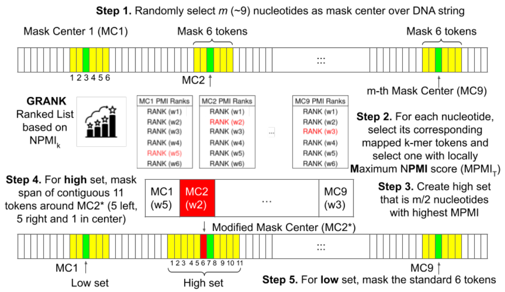

# GeneMask
Codebase for the paper "GeneMask: Fast Pretraining of Gene Sequences to Enable Few-Shot Learning" accepted for publication at the 26th European Conference on Artificial Intelligence [ECAI 2023](https://ecai2023.eu/) (Core A conference). The preprint is available at [https://arxiv.org/abs/2307.15933](https://arxiv.org/abs/2307.15933)

Here we provide the following resources required for: (a) Computing $Normalized-PMI_k$ for all 6-mers based on the Human Reference Genome. (b) PMI-best - pretraining and finetuning (c) Datasets of Prom-core, Prom-300, and Cohn-enh used for the different few-shot settings. (d) de novo motif discovery using the _rGADEM_ R package.

***The pre-trained model weights are available at this [Google Drive](https://drive.google.com/drive/folders/101qPYTdBFXR5XmPwZ-rCDFDD3gwsB9vj?usp=sharing) link.***



**DNABert**

1. Clone or download the GitHub repository from [https://github.com/jerryji1993/DNABERT](https://github.com/jerryji1993/DNABERT), as provided by the authors of DNABert.

2. Follow the exact environment setup instructions as mentioned under Section 1.

3. After completing this stage, the virtual environment with Python 3.6 will be ready with the packages and dependencies installed as provided by the _requirements.txt_ file under _./examples/_ subdirectory. Here "_."_ refers to the root directory (head).

4. Pretraining: The authors provide only a template file as pretraining data with 3000 examples, so we create the pretraining data from scratch based on the Human Reference Genome.

a) **Code-A**: Creation of pretraining data in k-mer format from the Human Reference Genome.

b) Store the pretraining data created at _./examples/sample\_data/pre _

c) **Code-B**: We modify the run\_pretrain.py file provided by the authors and thus provide the modified code.

i. This step has a data dependency of the ranked list of 6-mers based on Normalized-PMIn

ii. **Code-C**: We provide the code to create the ranked list given the Human Reference Genome as input

iii. **Data-A**: Final ranked list with PMI scores.

d) **Script-A**: As mentioned in the paper, we update the hyperparameters for PMI-best without HGA to adapt to the few-shot setting for model training and provide the training script to run

5. Finetuning: The authors only provide a template file from the Prom-core dataset. Thus we have to build the dataset from scratch based on the instructions mentioned by the authors.

a) **Data-B**: We provide the datasets for Prom-core, Prom-300, and Cohn-enh for all the few-shot settings. Create a folder at _./examples/sample\_data/ft-fewshot, _and a separate sub-directory for each few-shot setting can be created.

b) **Code-D**: We modify the _run\_finetune.py_ file provided by the authors and thus provide the modified code.

c) **Script-B**: We have two finetuning settings - one for 10, 50, and 100-shot (with FS) and the other for 500 and 1000-shot (without FS).

6. Prediction: We do not use any development set for hyperparameter optimization because it is the standard setup for few-shot text classification. Thus we use Script-B itself for testing. We put the test dataset in the directory of the DATA\_PATH environment variable, the same directory as the training data. We also remove the _evaluate\_during\_training_ flag so that the test dataset is only evaluated after completing the training.

**LOGO**

LOGO required a significant amount to reproduce, although the authors made the codes available at https://github.com/melobio/LOGO. The codes contained hard-coded path mentions, and the documentation was insufficient to resolve them. We then did a more in-depth analysis and noticed the following in their model pretraining code, which is available at [https://github.com/melobio/LOGO/blob/master/01\_Pre-training\_Model/02\_train\_gene\_transformer\_lm\_hg\_bert4keras\_tfrecord.py](https://github.com/melobio/LOGO/blob/master/01_Pre-training_Model/02_train_gene_transformer_lm_hg_bert4keras_tfrecord.py)

1. Lines 27 and 28 correspond to Albert's config, and the model is commented.

2. Lines 261 to 294, here they define the model configuration based on the Bert model instead of Albert. They take the Bert-base model and modify the configuration files to resemble Albert's setup.

Based on the above observations, we decided to use the DNABert model (based on Bert-base) and change the model configuration to that used by the authors of LOGO. The comparison between DNABert and LOGO is mentioned in Table 4 of the Appendix. Specifically, we modify the DNABert's 6-mer configuration file found at _./src/transformers/dnabert-config-6/config.json_ and provide modified code **(C****ode****-E)**.

Please store the modified configuration JSON file at _./src/transformers/logo-config-6/config.json _and copy the remaining files from the _dnabert-config-6_ subdirectory.

We follow the same pretraining and finetuning process as done in the case of DNABert, as described above. We have to add an extra parameter (one line) to  **Script-A** :

--config\_name=$SOURCE/src/transformers/dnabert-config/logo-config-$KMER/config.json \

**Motif Analysis**

**Code-F**: We provide the code to reproduce the de novo motif discovery results using the _rGADEM_ R package as described in Section 6.3 (Motif Analysis). The approach is based on the following resource: Unsupervised motif discovery tutorial from https://compgenomr.github.io/book/motif-discovery.html

If you use the codes or the contents of the paper, please cite:

```
@misc{roy2023genemask,
      title={GeneMask: Fast Pretraining of Gene Sequences to Enable Few-Shot Learning}, 
      author={Soumyadeep Roy and Jonas Wallat and Sowmya S Sundaram and Wolfgang Nejdl and Niloy Ganguly},
      year={2023},
      eprint={2307.15933},
      archivePrefix={arXiv},
      primaryClass={cs.CL}
}
```
